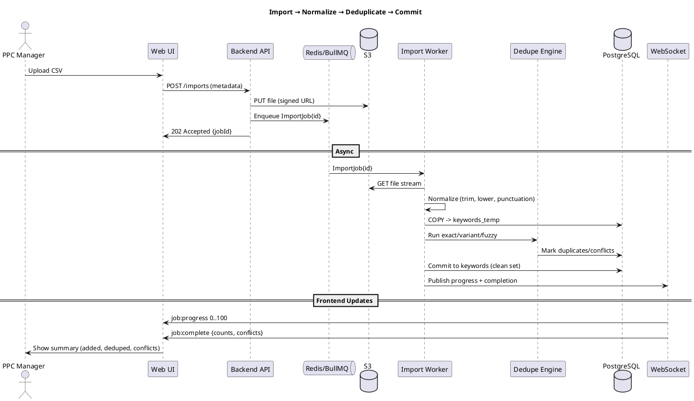
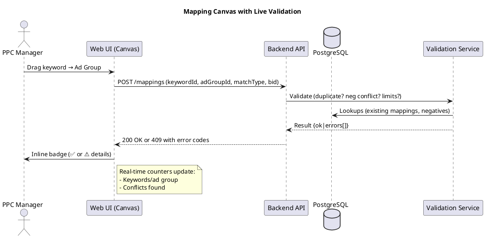
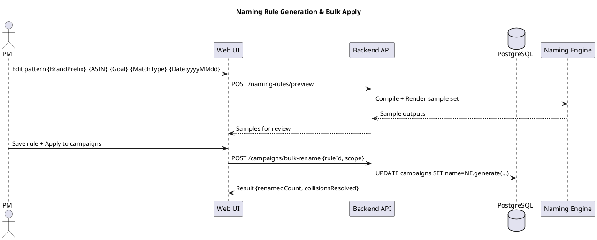
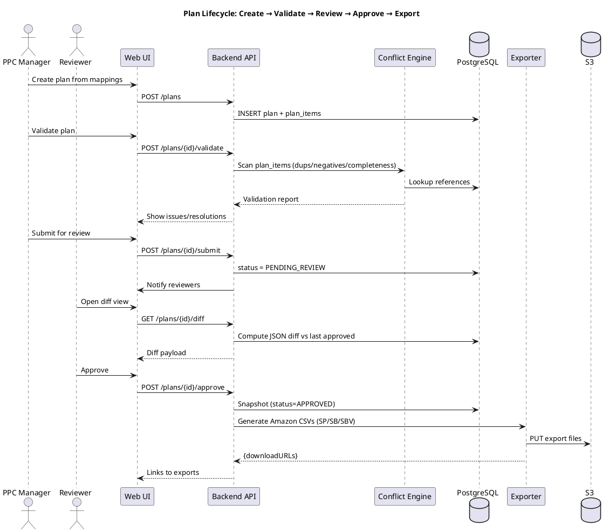
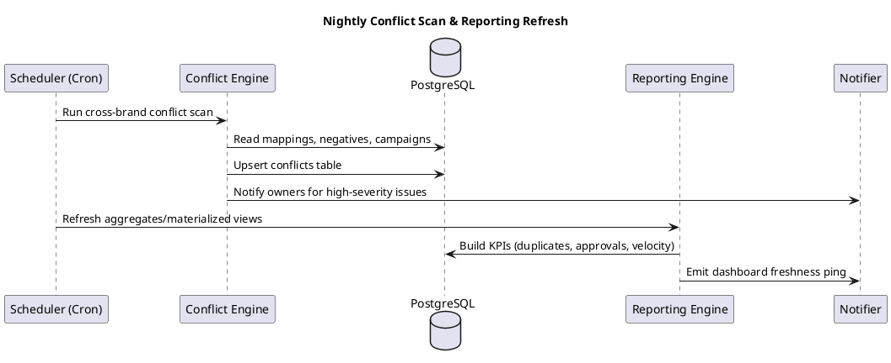
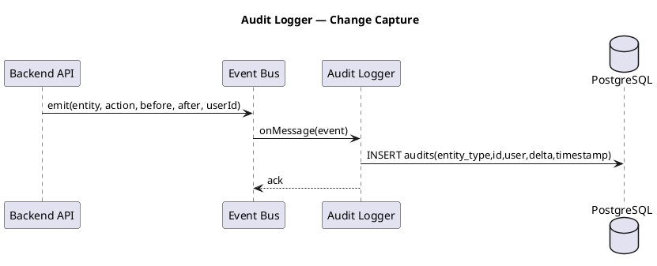
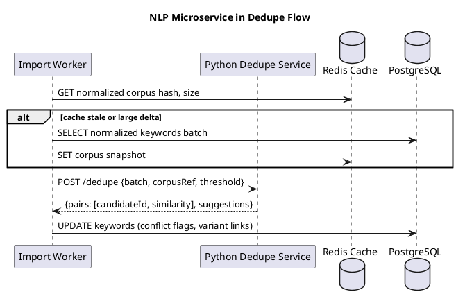
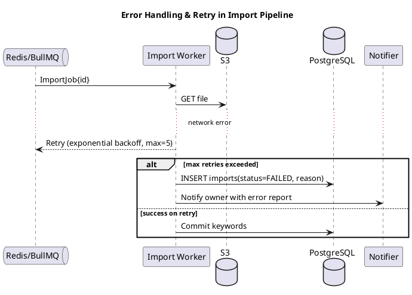
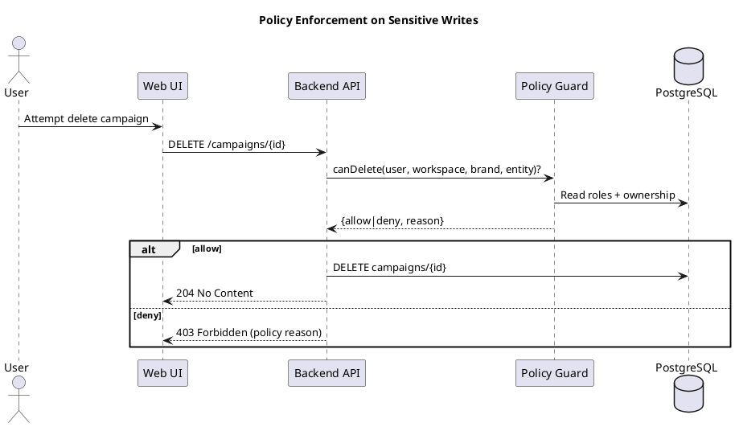

# Keyword Bank — Agent Sequence & Message Flows

This document visualizes how human and system agents interact across the main workflows.  
All diagrams use **PlantUML**. Copy-paste into any PlantUML renderer to generate images.

---

## 1) Keyword Import → Normalize → Deduplicate → Commit

---

## 2) Mapping Canvas (ASIN ↔ Ad Group ↔ Campaign) with Live Validation

---

## 3) Naming Rule Engine (Generate & Apply)

---

## 4) Plan Create → Validate → Review → Approve → Export

---

## 5) Nightly Conflict Scan & Reporting Refresh

---

## 6) Audit Logger (Event Sourcing Lite)

---

## 7) Optional: NLP Dedupe Microservice (Python)

---

## 8) Error & Retry Flow (Resiliency Pattern)

---

## 9) Permissions Guard (Policy Check)

---

## Notes

- Keep sequence steps tight: one intent per call.
- Emit structured error codes for UI to show precise, actionable messages.
- Prefer idempotent endpoints for async operations and retries.
